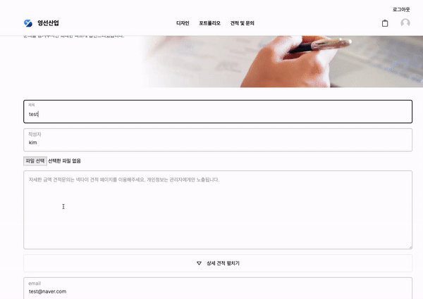

# 넥타이 디자인 편집 & 견적 서비스

**기획동기**

- 일반 소비자가 자신의 원하는 넥타이의 디자인을 직접 만들 수 있고, 제작 까지 받을 수 있는 서비스를 제공합니다.

**서비스 이용대상**

- 넥타이의 디자인을 직접 그리고 싶은 고객
- 넥타이의 제작 견적을 받고 싶은 고객

**서비스 목표**

- 원하는 넥타이의 패턴을 선택하고 이미지 파일을 첨부하여 디자인을 그릴 수 있습니다.
- 상세 견적내용을 선택하고 옵션에 따라 견적 금액을 받을 수 있습니다.

**향후 기술 목표**

- 다양한 디자인 패턴을 추가할 예정입니다.

# React Moveable을 활용한 넥타이 디자인 편집 서비스

## 1. 서비스 구성

- 사용 기술 스택
  

## 2. 나의 활동 내역

1. React Moveable를 활용한 디자인 편집
   

2. next-s3-upload를 활용한 이미지 업로드
   

3. 리랜더링 최소화를 위한 react-hook-form 사용
